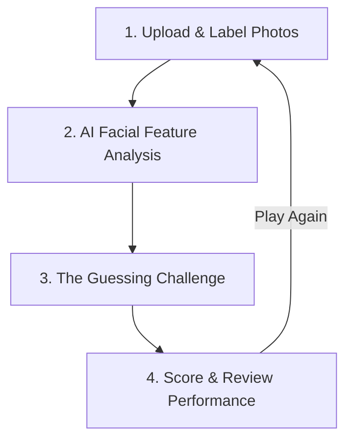

<div align="center">
  
</div>

<br />

<div align="center">
  <h1>👤 AI Face Guessing Game</h1>
  <p><strong>Upload photos, let Google's Gemini AI analyze and describe their facial features, and challenge your friends to guess who is who based on description alone!</strong></p>
  
  <p>
    
    
    
    
    
  </p>
</div>

---

## 🎯 What is the Face Guessing Game?

The **AI Face Guessing Game** is a modern, interactive web application that turns any group of photos into a fun, descriptions-based mystery game. 

Imagine you are playing *Guess Who?*, but instead of looking at a board, a state-of-the-art AI acts as the game master. It examines your friends', family's, or favorite celebrities' faces, creates a detailed profile describing their physical traits, and challenges players to guess who it is by typing their name or nicknames. 

It's the ultimate icebreaker, party game, or interactive test of how well you truly pay attention to the facial details of people you know!

---

## 🚀 How It Works: A Step-by-Step Walkthrough

The game is designed with a seamless, interactive 4-stage experience that is fully localized in both **English** and **Korean**.



### 📂 Step 1: Upload & Label (The Setup Phase)
Your adventure starts in the **Setup Room**:
* **Upload Photos:** Drag and drop or click to upload **2 to 10 portrait images**.
* **Identity Configuration:** For each uploaded photo, type in their **Primary Name** (e.g., `John`) and optional **Aliases** (e.g., `Johnny, J.Smith, Dad`). This ensures that the game can correctly match various nicknames when players guess.
* *Note: Images are processed entirely inside your browser and stored in your local database for top-notch privacy.*

---

### 🧠 Step 2: AI Face Analysis (The Processing Phase)
Once you press **Start Game**, our AI gets to work:
* **The Gemini Magic:** The app sends the images to Google Gemini's advanced multimodal engine.
* **Deep Facial Inspection:** The AI analyzes the face's unique structure, including hair style/color, facial shapes, eye characteristics, eyebrow density, skin tone/texture, nose profile, and mouth details.
* **Strict Game Fairness:** The AI is instructed to write descriptions under 60 words and strictly omit names, outfits, background environments, or accessories, keeping the description purely about facial features.
* **Face Verification:** If an uploaded photo does not contain a clear human face (or contains multiple faces), the AI flags it as `INVALID_IMAGE` to prevent bad gameplay, prompting you to swap it out.

---

### 🕵️‍♂️ Step 3: The Guessing Challenge (The Game Phase)
Now, the real fun begins!
* **Read the Clues:** The game presents a card showing only the AI-generated facial description (e.g., *"A person with a warm smile, expressive dark brown eyes, a slightly rounded nose, and short wavy black hair..."*).
* **Take a Guess:** Type your guess into the box. The game accepts the primary name or any of the aliases/nicknames you defined earlier (case-insensitive!).
* **The Big Reveal:** When you submit your answer, the card flips or fades to reveal the original image, telling you instantly whether you got it right or wrong!

---

### 📊 Step 4: The Performance Scorecard (The Results Phase)
After passing through all the photos:
* **Interactive Scorecard:** Review your final score, overall guessing **accuracy (%)**, and the total **time taken** to finish the round.
* **Review Sheet:** Look over a detailed grid of every photo. You can read the exact description Gemini generated, see the photo, and check what guess you submitted versus the actual correct names.
* **Replay or Reset:** Choose to **Replay Same Photos** to beat your previous time, or click **New Game** to clear the deck and upload a completely fresh set of faces!

---

## 💎 Premium Design & Technical Highlights

* **⚡ Ultra-Fast Build with Vite + React 19:** Enjoy instantaneous load times and smooth page transitions built on the cutting edge of web frameworks.
* **🎨 Sophisticated, Modern UI:** Uses curated HSL color schemes, sleek dark/light card shadows, elegant typography from Google Fonts, and tactile micro-animations to create a premium feel.
* **🔒 Strict Privacy-First Architecture:** 
  * Unlike standard apps that upload your photos to random servers, this app stores your session's pictures locally inside your browser's **IndexedDB**.
  * Pictures are only sent to the official Google Gemini API via secure HTTPS requests to generate descriptions. Your images are never saved on a third-party server.
  * Clearing the session completely purges all images from your local IndexedDB storage.
* **🌐 Native Dual-Language Support:** Full translation suite for English and Korean, automatically toggleable from the header.

---

## 🛠️ Local Development & Installation

Getting the app running locally takes less than 2 minutes.

### Prerequisites
Make sure you have [Node.js](https://nodejs.org/) installed (v18+ recommended).

### 1. Clone & Navigate
```bash
git clone <repository-url>
cd Test-Face-Guessing-Game
```

### 2. Install Dependencies
```bash
npm install
```

### 3. Configure Your API Key
Create a `.env.local` file in the root directory and add your Google Gemini API key:
```env
GEMINI_API_KEY=your_actual_gemini_api_key_here
```
> 🔑 **Need an API key?** You can get a free key in minutes from the [Google AI Studio](https://aistudio.google.com/).

### 4. Fire Up the Dev Server
Launch the development server:
```bash
npm run dev
```
Open [http://localhost:5173](http://localhost:5173) in your browser to start playing!

---

## 📖 Under the Hood: The AI Prompt

Our AI generator uses Google Gemini to read faces objectively. The core instruction given to the model is carefully tuned:

```text
Analyze the image and provide a detailed physical description of the person's facial features for a guessing game. 
Focus ONLY on: Face shape, skin tone/texture, hair color/style, eyes, eyebrows, nose, and mouth. 

Rules:
1. Do NOT mention the person's name.
2. Do NOT mention clothing, background, or accessories (like glasses if possible).
3. Keep it objective and non-judgmental.
4. Maximum 60 words.
5. If no human face is clearly visible or if there are multiple people, return exactly: "INVALID_IMAGE".
```

---

<div align="center">
  <p>Created with ❤️ using React, TypeScript, and Google Gemini API.</p>
</div>
